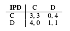
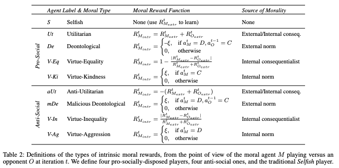

# Dynamics of Moral Behavior in Heterogeneous Populations of Learning Agents

This repository contains implementation and analysis code for the following paper: 
Dynamics of Moral Behavior in Heterogeneous Populations of Learning Agents, AIES'24. 

[(arXiv version with Appendix)](https://arxiv.org/abs/2403.04202) 


## Cite us
***

If you use this code, please cite the following paper:

```bibtex
@INPROCEEDINGS{Tennant-AIES2024,
  title     = {Dynamics of Moral Behavior in Heterogeneous Populations of Learning Agents},
  author    = {Tennant, Elizaveta and Hailes, Stephen and Musolesi, Mirco},
  booktitle = {Proceedings of the 7th AAAI/ACM Conference on AI, Ethics & Society (AIES'24)},
  publisher = {AAAI / ACM},
  editor    = {},
  pages     = {},
  year      = {2024},
  month     = {},
  note      = {Main Track},
  doi       = {},
  url       = {[https://doi.org/10.24963/ijcai.2023/36](https://arxiv.org/abs/2403.04202)},
}

```

You can contact the authors at: `l.karmannaya.16@ucl.ac.uk`

## Setup

Intall packages listed in requirements.txt into a Python environment. 
```
pip install -r requirements.txt
```

## The environment 

This code can be used to run a simulation of social dilemma games within populations agents - at every step, an agent M selects an opponent O, and then M and O play a one-shot Prisoner's Dilemma game. We use a Reinforcement Learning paradigm where each agent learns accoridng to a reward signal:
The reward is defined by the agent's payoff in a game:


We use a pradigm where each gent learns how to select a partner AND learns how to play the game using the same reward signal. 

## The agents 

These experiments conduct a systematic comparison of interactions between pairs of various moral learning agents in each of the dilemma games. The moral agents (prosocial and antisocial) are defined using the following intrnisic rewards: 




## Run the experiments

### Setup 

Env setup & package installs 


### Simple test for running population simulation 
```
python3 main.py --destination_folder 3xS --num_iterations 10 --num_runs 1
```

### Run core experiments, population size = 16 
```
python3 main.py --destination_folder 8xS_1xUT_1xaUT_1xDE_1xmDE_1xVEe_1xVie_1xVEk_1xVagg --num_iterations 30000 --num_runs 20 & 
python3 main.py --destination_folder 1xS_8xUT_1xaUT_1xDE_1xmDE_1xVEe_1xVie_1xVEk_1xVagg --num_iterations 30000 --num_runs 20 & 
python3 main.py --destination_folder 1xS_1xUT_8xaUT_1xDE_1xmDE_1xVEe_1xVie_1xVEk_1xVagg --num_iterations 30000 --num_runs 20 & 
python3 main.py --destination_folder 1xS_1xUT_1xaUT_8xDE_1xmDE_1xVEe_1xVie_1xVEk_1xVagg --num_iterations 30000 --num_runs 20 & 
python3 main.py --destination_folder 1xS_1xUT_1xaUT_1xDE_8xmDE_1xVEe_1xVie_1xVEk_1xVagg --num_iterations 30000 --num_runs 20 & 
python3 main.py --destination_folder 1xS_1xUT_1xaUT_1xDE_1xmDE_8xVEe_1xVie_1xVEk_1xVagg --num_iterations 30000 --num_runs 20 & 
python3 main.py --destination_folder 1xS_1xUT_1xaUT_1xDE_1xmDE_1xVEe_8xVie_1xVEk_1xVagg --num_iterations 30000 --num_runs 20 & 
python3 main.py --destination_folder 1xS_1xUT_1xaUT_1xDE_1xmDE_1xVEe_1xVie_8xVEk_1xVagg --num_iterations 30000 --num_runs 20 & 
python3 main.py --destination_folder 1xS_1xUT_1xaUT_1xDE_1xmDE_1xVEe_1xVie_1xVEk_8xVagg --num_iterations 30000 --num_runs 20 
```

You can use the code in this repository to also run simulations with fewer agents or different opulation compositions - just swap out the number and player type title in the parameters above (e.g.,:

```
python3 main.py --destination_folder 1xUT_1xaUT_1xDE --num_iterations 30000 --num_runs 20 & 
``` 


## Parameters

...

## Plotting 

The following parametes were used for the main experiments - these are possible top modify in the command line or in the config.py file. ]

```
--num_iterations 30000 
--num_runs 20 
```


