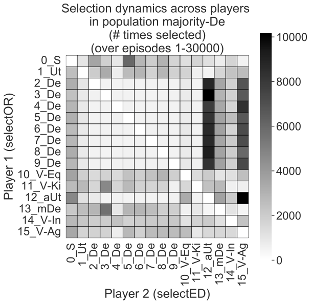

# Dynamics of Moral Behavior in Heterogeneous Populations of Learning Agents

This repository contains implementation and analysis code for the following paper: 
Dynamics of Moral Behavior in Heterogeneous Populations of Learning Agents, AIES'24. [(Paper & Appendix on arXiv)](https://arxiv.org/abs/2403.04202) 

 


## Cite us
***

If you use this code, please cite the following paper:

```bibtex
@INPROCEEDINGS{Tennant-AIES2024,
  title     = {Dynamics of Moral Behavior in Heterogeneous Populations of Learning Agents},
  author    = {Tennant, Elizaveta and Hailes, Stephen and Musolesi, Mirco},
  booktitle = {Proceedings of the 7th AAAI/ACM Conference on AI, Ethics & Society (AIES'24)},
  publisher = {AAAI / ACM},
  pages     = {1444-1454},
  year      = {2024},
  month     = {10},
  note      = {Main Track},
  doi       = {https://doi.org/10.1609/aies.v7i1.31736}
}

```

You can contact the authors at: `l.karmannaya.16@ucl.ac.uk`

## Setup

see main.py 

Intall packages listed in requirements.txt into a Python environment. 
```
pip install -r requirements.txt
```

## The problem 

Existing studies implement multi-agent Reinforcement Learning (MARL) with agents all learning according to a similar reward function (usually, indicating Selfish reward). Therefore a gap remians in understanding emergent behaviours and outcomes in MARL interactions among societies of heterogeneous agents. In this paper, we simulate multi-agent learning in societies of morally diverse agents, implementing a partner selection mechanism (Anastassacos et al., 2020) as well as a mechanism for learning to play a dilemma game based on Deep Q-Learning. We evaluate selection patterns including coalition formation, and behaviours emerging in the dilemma game, including exploitation of some player types by others. Finally, we also observe interesting impacts of the prevalenve of certain prosocial agents in a society on the learning of a Selfish agent. 

## The environment 

This code can be used to run a simulation of social dilemma games within populations agents - at every step, an agent M selects an opponent O, and then M and O play a one-shot Prisoner's Dilemma game. We use a Reinforcement Learning paradigm where each agent learns accoridng to a reward signal:
The reward is defined by the agent's payoff in a game:


We use a pradigm where each agent learns how to select a partner AND learns how to play the game using the same reward signal. 

## The agents 

These experiments conduct a systematic comparison of interactions between pairs of various moral learning agents in each of the dilemma games. The moral agents (prosocial and antisocial) are defined using the following intrnisic rewards: 


## Run the experiments

### Setup 

Env setup & package installs 
see main.py 


### Simple test for running population simulation 
```
python3 main.py --destination_folder 3xS --num_iterations 10 --num_runs 1
```

### Run core experiments, population size = 16 
```
python3 main.py --destination_folder 8xS_1xUT_1xaUT_1xDE_1xmDE_1xVEe_1xVie_1xVEk_1xVagg --num_iterations 30000 --num_runs 20 & 
python3 main.py --destination_folder 1xS_8xUT_1xaUT_1xDE_1xmDE_1xVEe_1xVie_1xVEk_1xVagg --num_iterations 30000 --num_runs 20 & 
python3 main.py --destination_folder 1xS_1xUT_8xaUT_1xDE_1xmDE_1xVEe_1xVie_1xVEk_1xVagg --num_iterations 30000 --num_runs 20 & 
python3 main.py --destination_folder 1xS_1xUT_1xaUT_8xDE_1xmDE_1xVEe_1xVie_1xVEk_1xVagg --num_iterations 30000 --num_runs 20 & 
python3 main.py --destination_folder 1xS_1xUT_1xaUT_1xDE_8xmDE_1xVEe_1xVie_1xVEk_1xVagg --num_iterations 30000 --num_runs 20 & 
python3 main.py --destination_folder 1xS_1xUT_1xaUT_1xDE_1xmDE_8xVEe_1xVie_1xVEk_1xVagg --num_iterations 30000 --num_runs 20 & 
python3 main.py --destination_folder 1xS_1xUT_1xaUT_1xDE_1xmDE_1xVEe_8xVie_1xVEk_1xVagg --num_iterations 30000 --num_runs 20 & 
python3 main.py --destination_folder 1xS_1xUT_1xaUT_1xDE_1xmDE_1xVEe_1xVie_8xVEk_1xVagg --num_iterations 30000 --num_runs 20 & 
python3 main.py --destination_folder 1xS_1xUT_1xaUT_1xDE_1xmDE_1xVEe_1xVie_1xVEk_8xVagg --num_iterations 30000 --num_runs 20 
```

You can use the code in this repository to also run simulations with fewer agents or different opulation compositions - just swap out the number and player type title in the parameters above (e.g.,:

```
python3 main.py --destination_folder 1xUT_1xaUT_1xDE --num_iterations 30000 --num_runs 20 & 
``` 


## Parameters

The following command line parametes were used for the main experiments:
```
--num_iterations 30000 
--num_runs 20 
```

For all other parameters, see the simulation/config.py file. 

## Plotting 

see ```plotting.py```


